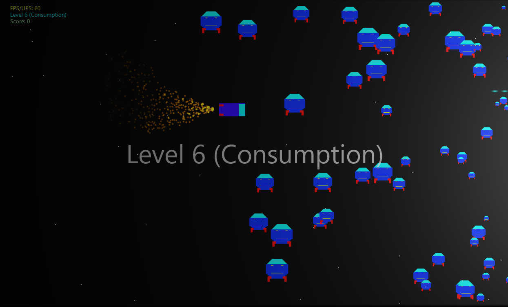

# FxGame-2D-Space-Shooter
A 2D space game game written in pure Java/FX (Java 11).

## How to play

The current goal is just to survive as long as possible and reach the last level.
Shooting enemies down, grants points which count to your high score.

### Controls
 
W - Move up (player and menu)

A - Move down (player and menu)

S - Move left

D - Move right

P - Pause / Resume

Space - Shoot

Enter - Select (Menu)

## Contribution

Contribution in any form is highly appreciated :) 
You can either take an issue (if there are any) or just
submit a PR with changes you find useful.

Have a nice day! 

## License

MIT License

Copyright (c) 2018 Niklas Schultz

Permission is hereby granted, free of charge, to any person obtaining a copy
of this software and associated documentation files (the "Software"), to deal
in the Software without restriction, including without limitation the rights
to use, copy, modify, merge, publish, distribute, sublicense, and/or sell
copies of the Software, and to permit persons to whom the Software is
furnished to do so, subject to the following conditions:

The above copyright notice and this permission notice shall be included in all
copies or substantial portions of the Software.

THE SOFTWARE IS PROVIDED "AS IS", WITHOUT WARRANTY OF ANY KIND, EXPRESS OR
IMPLIED, INCLUDING BUT NOT LIMITED TO THE WARRANTIES OF MERCHANTABILITY,
FITNESS FOR A PARTICULAR PURPOSE AND NONINFRINGEMENT. IN NO EVENT SHALL THE
AUTHORS OR COPYRIGHT HOLDERS BE LIABLE FOR ANY CLAIM, DAMAGES OR OTHER
LIABILITY, WHETHER IN AN ACTION OF CONTRACT, TORT OR OTHERWISE, ARISING FROM,
OUT OF OR IN CONNECTION WITH THE SOFTWARE OR THE USE OR OTHER DEALINGS IN THE
SOFTWARE.
